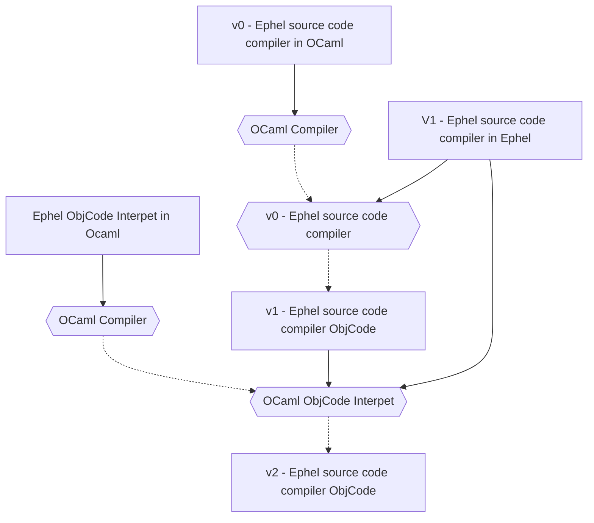

# Ephel Roadmap

## Bootstrap

### Stage 0: In Ocaml

A first compiler of a subset of Ephel source code and a runtime dedicated to the interpretation
are proposed

### Stage 1: Ephel Compiler

This first compiler written in Ephel producing Ephel bytecode. Its compilation produces an 
Ephel source code compiler objcode

### Stage 2: Ephel Compiler once again

We replay the compilation with the v1.

## Extensions

### Stage 1: Type checker

### Stage 2: Level language

