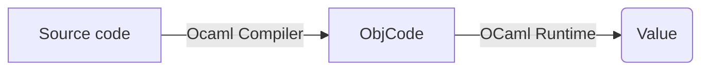
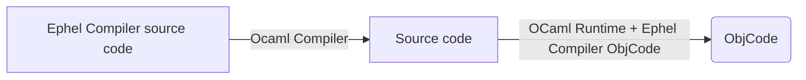

# Ephel Roadmap

## Bootstrap

### Stage 1: Ocaml compiler

This compiler is a simple and basic runtime dedicated
to the interpretation of Nethra like source code.

### Stage 2: Ephel Compiler

This first compiler written in Ephel produces Compiler bytecode.

### Stage 3: Ephel Runtime

Such a runtime allows Ephel source code to be executed in another runtime. 
For this purpose, the Rust, Go, Java, C#, C++, Javascript and WASM runtimes 
should also be targeted.

## Extensions

### Stage 1: Type checker

### Stage 2: Level language

