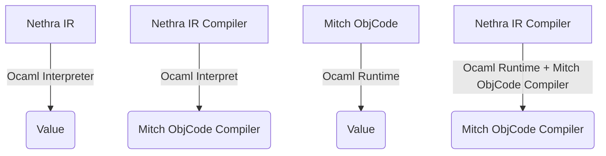

# Ephel Roadmap

## Bootstrap

### Stage 1: Ocaml Nethra Interpreter

This interpret is a simple and basic runtime dedicated
to the interpretation of Nethra code.

### Stage 2: Nethra IR Compiler

This first compiler written in Nethra produces Mitch bytecode.

### Stage 3: Ocaml Mitch Runtime

Such a runtime allows Ephel code to be executed in another runtime. For this purpose, the Rust, Go, Java, C#, C++ and Javascript runtimes should also be targeted.

## Extensions

### Stage 1: Nethra type checker

### Stage 2: Higher level language

